# Деревья, структуры данных

#### 1\. Splay. Три вида поворотов. Операция Splay, Add.

**Splay-дерево** - самобалансирующееся BST дерево, не хранящее в вершине
никакой дополнительной информации. В худшем случае глубина дерева
может быть линейна, но амортизационное время всех операций получится
за `O(log n)`.

**Splay** - совершает повороты, то есть чередует различные виды поворотов.

- Zig.
  
<div align="center">

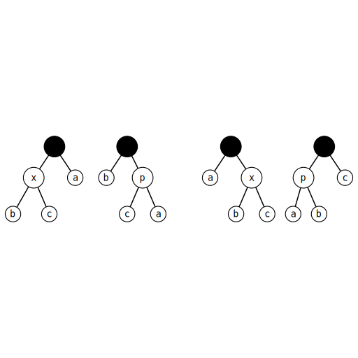

</div>

Если `p` - корень дерева с сыном `x`, то совершаем один поворот вокруг
ребра `(x, p)` делая `x` корнем дерева.

- Zig-zig.

<div align="center">

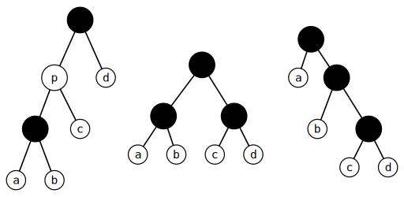

</div>

Если `p` - не корень, а `x` и `p` оба левые или оба праве дети, то
делаем поворот ребра `(p, g)`, где `g` отец `p`, а затем поворот
`(x, p)`.

- Zig-zag.

<div align="center">

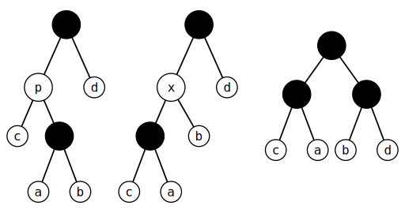

</div>

Если `p` - не корень дерева и `x` левый ребенок, а `p` - правый ребенок
`g`, или наоборот, то делаем поворот вокруг ребра `(x, p)`, а затем
поворот нового ребра `(x, g)`, где `g` - бывший родитель `p`.

**Add** - запускам `splay(tree, x)`, если `x` уже был в дереве, то он
становится корнем.

Иначе, если текущий корень меньше `x`, то подвесим его и его левое
поддерево, как левое поддерево для `x`, а правое поддерево
текущего корня, найденного `splay`, как правое поддерево.
Аналогично, то есть наоборот, для случая, когда текущий корень
больше `x`.

#### 2\. Splay. Формулировка главной теоремы о времени работы.

Оценим амортизационное время операции splay, поднявшей `v` в `u`:


`R_k = log(size_k)`, где `size_k` - размер поддерева.

#### 3\. Rope. Корневая. Через Split/Merge.

**Rope** - интерфейс для структуры данных, чтобы она умела производить
следующие операции.

a. insert, erase
b. split, merge, rotate

...

#### 4\. LCA-Offline.

…

#### 5\. Heavy-Light Decomposition. Определение, построение за `O(n)`.

Дано произвольное дерево с весами в вершинах, нужно считать функцию
на путях дерева, и поддерживать изменение весов вершин.

**Heavy-Light декомпозиция** - пути, образованные тяжелыми ребрами.

<div align="center">

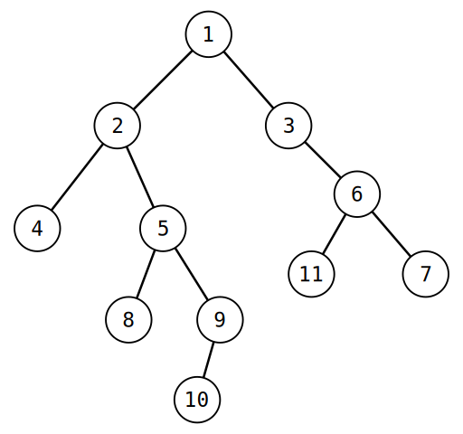

</div>

#### 6\. Heavy-Light Decomposition. Подробности реализации.

```javascript
void buildHLD(int v) {
    size[v] = 1;
    ma = -1;
    
    for (int x : children[v]) {
        buildHLD(x); // рекурсивно вычисляем детей
        size[v] += size[x];
        if (ma == -1 || size[x] > size[ma]) // выбираем первого ребенка
                                            // или тяжелое поддерево
            ma = x;
    }
    
    path[v] = (ma == -1 ? path_n++ : path[ma]); // новый путь,
                                // или пометка существующего пути для v
    pos[v] = len[path[v]]++; // позиция v в текущем пути
    top[path[v]] = v; // верхняя вершина для каждого пути
}
```

#### 7. Heavy-Light Decomposition. Функции на пути за O(log^2 n).

От любой вершины до корня не более, чем `log n` прыжков. Возьмём `lca(v, u)`,
построим путь `v -> lca -> u`. Так как прыжков у нас не более `log n`, а функция
на дереве отрезков выполняется за `log n`, то функция на пути выполняется
за `O(log^2 n)`.


#### 8. Heavy-Light Decomposition. Функции поддерева за O(log n).

Функция для одной вершины выполняется за `O(log n)`, так как лежит в одном ДО.

# Паросочетания

#### 9\. Определение и сложность задач в двудольном и произвольном графе: паросочетание, поиск вершинного покрытия, независимого множества, совершенного паросочетания.

  - **Паросочетание** - множество попарно несмежных ребер.
    <div align="center" style="margin: 0; padding: 0;">
    
    </div>
  - **Вершинное покрытие** - множество таких вершин C, что для любого
    ребра один из концов лежит в C.
    <div align="center" style="margin: 0; padding: 0;">
    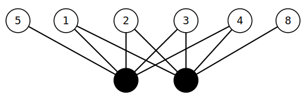
    </div>
  - **Независимое множество** - попарно несмежные вершины.
    <div align="center" style="margin: 0; padding: 0;">
    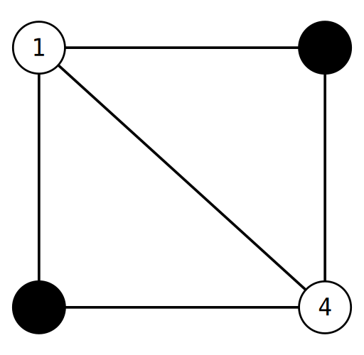
    </div>
  - **Совершенное паросочетание** - паросочетание, покрывающее все
    вершины графа.
    <div align="center" style="margin: 0; padding: 0;">
    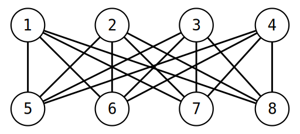
    </div>

> В двудольном графе совершенное паросочетание - паросочетание,
> покрывающее все вершины меньшей доли.

В произвольном графе задачи: вершинного покрытия, независимого множества - **NP-трудны**.

Паросочетание в двудольном графе ищется за `O(|M| E)`. В произвольном за
`O(V^3)` - алгоритмом сжатия “соцветий” (*видим нечётный цикл - сожмём
его, найдем паросочетание в новом цикле, разожмём цикл, перестроим
паросочетание*), используемом в реализации Габова. Алгоритм Эдмондса - `O(E sqrt(V))`

#### 10\. Лемма о дополняющем пути.

**Чередующийся путь** - путь, в котором идет ребро из паросочетания (не
из паросочетания), а затем ребро не из паросочетания (из
паросочетания).

**ДЧП** (*дополняющий чередующийся путь*) - путь начинающийся и
заканчивающийся в свободной вершине.

<div align="center" style="margin: 0; padding: 0;">

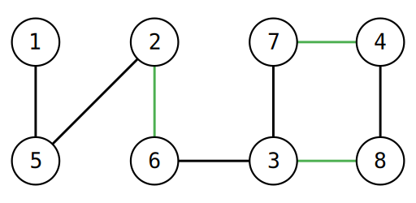

</div>

> Красные ребра - ребра из паросочетания, а зеленые - нет. Их
> чередование - ДЧП.

**Свободная вершина** - вершина, не принадлежащая паросочетанию.

**Лемма**. Паросочетание `M` максимально <=> не существует ДЧП.

(**=\>**) Предположим, что паросочетание `M` - максимально, и существует
дополняющий путь `P`. Пройдемся по нему: все ребра не из паросочетания
добавятся в паросочетание, а другие удалятся из него. То есть мы
получаем паросочетание `M'` большее `M`, противоречие.

(**\<=**) Пусть есть два паросочетания `M`, `M'` такие, что `|M'| >
|M|`, тогда существует ДЧП относительно `M`. Рассмотрим подграф `H = M
\xor M'`. Граф, в котором будут только ребра, принадлежащие только
одному из паросочетаний. В таком графе степень каждой вершины не
больше двух, так как каждая вершина максимум инцидентна ребру из `M` и
`M'`. В таком графе каждая компонента связности - цикл или путь, в
которых чередуются ребра из M и M’. Так как `|M'| > |M|`, то есть
компонента связности, в которой ребер из `M'` будет больше. Это может
быть только путь, у которого оба крайних ребра принадлежат `M'`. Относительно
`M` этот путь есть ДЧП.

<div align="center" style="margin: 0; padding: 0;">

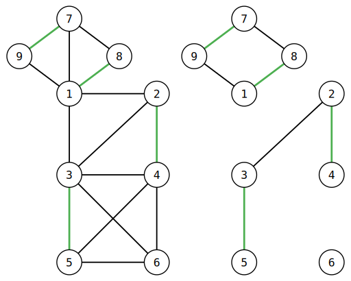

</div>

#### 11\. dfs для дополняющего пути, простейший алгоритм за O(V(V + E)).

Пусть `G` - двудольный граф, а `P` паросочетание в нем. Построим граф
`G'(G, P)`, в котором вершины такие же, как в `G`. Ребра: из первой доли
во вторую пустим все рёбра `G`, а из второй в первую ребра из
паросочетания `P`.

Получается, что поиск ДЧП - это поиск пути из свободной в свободную
вершину в графе `G'`.

``` javascript
...

bool dfs(int v) {
    used[v] = true;
    for (int to : graph[v])
        if (pair[to] == -1) or (!used[pair[to]] && dfs(pair[to]))
            pair[to] = v
            return true;
    return false;
}

...

for (int i = 1..n) {
    used[..] = 0;
    dfs(i);
}

...
```

#### 12\. Алгоритм поиска VC и IS за O(E).

Ориентируем ребра паросочетания, чтобы они шли из правой доли в левую,
ребра не из паросочетания — так, чтобы они шли из левой доли в правую.
В графе `G'` запустим `dfs` из свободных вершин первой доли, где
обозначим `A` - первая доля, `B` - вторая. Все посещенные `dfs`
вершины обозначим `A^+`, `B^+`, а непосещённые `A^-`, `B^-`.

`X = A^- \cup B^+` - минимальное вершинное покрытие.

`Y = A^+ \cup B^-` - максимальное независимое множество. Из `A^+` в
`B^-` нет ребер, иначе мы смогли пройти по ним.

<div align="center" style="margin: 0; padding: 0;">

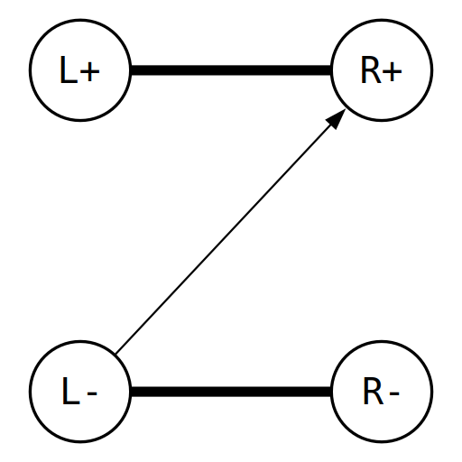

</div>

#### 13\. Разбиение вершин орграфа на циклы. Разбиение вершин ацикличного орграфа на минимальное число путей.

**Дан ацикличный орграф (DAG). Разбить все его вершины на минимальное
число путей.**

Возьмём двудольный граф по 𝑛 вершин в каждой доли. Проведём ребро 𝑖 → 𝑗
исходного графа из 𝑖-й вершины первой доли в 𝑗-ую вершину второй доли.
Такая операция называется «раздвоение орграфа». В раздвоенном графе
возьмём рёбра максимального паросочетания, нарисуем их в исходном,
получили разбиение на минимальное число путей.

...

#### 14\. Stable matching (marriage problem). Постановка задачи. Решение. Пример про ЕГЭ.

Сформулируем задачу на языке мальчиков/девочек. Есть `n` мальчиков, у
каждого из них есть список девочек `bs[a]`, которые ему нравятся в
порядке наиболее приоритетных к менее. Есть `m` девочек, у которых
есть такой же список, относящийся к мальчикам, `as[b]`. `!` Мальчики
и девочки хотят образовать пары.

Никто не готов образовывать пару с тем, кто вообще отсутствует в его
списке. И для мальчиков, и для девочек наименее приоритетный вариант - остаться без пары.

> Обозначим `p_a` - пара для мальчика `a` или `-1`, `q_b` - пара для
> девочки `q` или `-1`.

Паросочетание называется `не стабильным`, есть существует мальчик `a` и
девочка `b`: мальчику `a` нравится `b` больше чем `p_a` и девочке `b`
нравится `a` больше чем `q_b`.

Иначе паросочетание называется `стабильным`.

**Решение:** Изначально проинициализируем `p_a = bs[a].best`, далее,
пока есть `i != j` и девочка `b = p_i = p_j != -1`. Девочка `b`
откажет тому из них, кто ей меньше нравится. Пусть она отказала
мальчику `i`, тогда делаем `bs[i].remove_best()`, `p_i =
bs[i].best`.

**Пример:** Студенты хотят поступить в ВУЗы. У каждого ВУЗа есть
ограниченное количество мест и могут быть разные приоритеты,
кого хотят брать. Строим двудольный граф, каждый студент указывает
список ВУЗов в приоритетности. Каждое место-в-вузе получает список
студентов в порядке приоритета данного ВУЗа. Ищем стабильное
паросочетание, получаем решение, оптимальное для студентов.

# Потоки

#### 15\. Def: поток, разрез, величина потока, величина разреза, сотаточная сеть, циркуляция, прямые и обратные ребра, декомпозиция потока.

**Поток в орграфе** из s в t - сопоставленные ребрам числа `f_e \in
\mathbb{R}`.


**Разрез** - дизъюнктное разбиение вершин (S, T): `v = S \cup T. s \in S, t \in T`.

**Величина потока** `|f|` = `\sum_{e \in out(s)} f_e` - `\sum_{e \in
in(s)} f_e`

**Величина разреза** - называется сумма пропускных способностей таких
рёбер (i, j) что `i \in S , j \in T`.

**Циркуляция** - поток величины нуль.

**Прямые и обратные ребра** - для каждого ребра сети `G` с пропускной
способностью `c_e` создадим обратное ребро `e'` пропускной
способностью 0. При этом по определению `f_e'` = `-f_e`.

**Декомпозиция потока f** - представление `f` в виде суммы элементарных
потоков (путей) и циркуляции.

**Остаточная сеть потока f** - `G_f`, граф с пропускными способностями
c\_e - f\_e.

#### 16\. Алгоритм Форда-Фалкерсона. Время работы. Без доказательства.

**Теорема**. Форда-Фалкерсона. 
1. `|f|` = max <=> нет дополняющего пути. 
2. `max |f|` = `min C(S, T)` (максимальный поток равен
минимальному разрезу)

Из теоремы следует простейший алгоритм поиска максимального потока: пока
есть дополняющий путь p, найдем его, толкнем по нему `x = min (c_e -
f_e)`, где `e \in p`, единиц потока.

Время работы алгоритма `O(|f| E)`.

``` javascript
int dfs(int v, int go) {
    used[v] = 1;
    if (v == t) return go;

    for (int edge : vertexes[v]) {
        Edge& e = edges[edge];
        if (e.f < e.c && !used[e.b]) {
            int push = dfs(e.b, min(e.c - e.f, go));
            if (push) {
                e.f += push;
                edges[e.rev].f -= push;
                return push;
            }
        }
    }
    return 0;
}
```

#### 17\. Поиск min разреза по max току за `O(E)`.

Пусть нет дополняющего пути => `dfs` из `s` по ненасыщенным ребрам не
посетит `t`. Множество посещенных вершин обозначим `S`, обозначим `T =
V \ S`. Из `S` в `T` ведут только `e`: `f_e = c_e`. Это же есть алгоритм
min разреза по max потоку за `O(E)`.

#### 18\. Декомпозиция потока на пути за `O(E^2)`. Циркуляция.

Пока `|f| > 0` найдем путь `p` из `s` в `t` по ребрам `e`: `f_e > 0`. По
всем ребрам пути уменьшим поток на `min f_e`, `e \in p`.

`O(E^2)` после нахождения пути и уменьшения потока, как минимум у одного
ребра `f_e` обнулится => не более `E` поисков пути.

#### 19\. Решение задачи про `k` непересекающихся по ребрам/вершинам путей.

**Поиск реберно непересекающихся путей** *Орграф:* каждому
ориентированному ребру зададим пропускную способность `1`,
найдем максимальный поток. `|f|` - количество реберно непересекающихся
путей.

*Неорграф:* приводим к орграфу, делаем то же самое. Где обратные ребра имеют такую же пропускную способность, как и прямые.

**Поиск вершинно непересекающихся путей** *Орграф:* раздваиваем вершину,
посередине ребро с пропускной способностью 1, входящие ребра в первую
половину, исходящие из второй. Вершину посещаем только один раз, так как
пропускная способность равна 1.

<div align="center" style="margin: 0; padding: 0;">

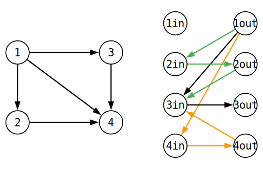

</div>

*Неорграф:* приводим к орграфу, делаем то же самое.

#### 20\. Поиск паросочетания через поток за `O(VE)`.

Чтобы с помощью поток искать максимальное паросочетание добавим исток и
сток. Из стока направим ребра в первую долю с пропускными способностями - `1`. Аналогично из второй доли в сток. Если изначально двудольный граф
был неориентированным, то направим ребра из первой во вторую долю.
Пропускная способность этих ребер может быть любой, так как из
вершины не второй доли в сток не может пойти поток больше `1`.
Запустим алгоритм Форда-Фалкерсона за `O(|f| * E) = O(|M| * E) <=
O(VE)`.

#### 21\. Глобальный разрез: определение, базовое решение на `O(V * flow)`.

**Глобальный разрез** равен минимуму среди разрезов минимальной
стоимости по всевозможным парам исток-сток.

Простейшее решение: переберем `s`, `t` и найдем разрез между ними за
`O(V * flow)`.

#### 22\. Транспортная задача. Формулировка. Решение.

В городе есть дороги, заводы и магазины. Дороги образуют орграф, у
каждой дороги есть длина `w_i` и пропускная способность `u_i`.
Каждый день `i`-й завод выпускает `A_i` единиц товара, а `j`-й
магазин продает `B_j` единиц. Нужно построить план доставки, чтобы
`\sum f_i \cdot w_i` была минимальна.

**Решение:**
Добавляем исток, из него вершины с пропускной способностью `A_i`.
Добавляем сток, из второй доли - магазинов, проведем ребра с пропускной способностью
`B_i`. Найдем mincost max flow.

Если `c_e = inf`, то строим матрицу расстояний, двудольный граф. Ищем
mincost flow или венгерка.

#### 23\. Задачи mincost k-flow, mincost max flow, mincost circulation. Сведения друг к другу.

**Mincost k-flow** - поиск минимального по весу потока величиной `k`.

**Mincost max flow** - поиск максимального потока за минимальную стоимость.

**Mincost circulation** - найти поток нулевой величины с минимальной стоимостью.

...

#### 24. Алгоритм поиска mincost k-flow в графе без отрицательных циклов за `O(k * FordBellman)`.

Запускаем алгоритм Форда-Беллмана, который будет искать поток из `s` в `t` 
с минимальным весом до тех пор, пока он не станет `k`.

```javascript

bool fordBellaman() {
    dist[..] = INF;
    used[..] = 0;
    
    dist[s] = 0;
    used[s] = 1;
    
    fl = INF;
    
    queue.push(s);
    while (!queue.empty()) {
        int v = queue.pop();
        for (int to : graph[v]) {
            Edge & e = edges[to];
            if (e.f < e.c && dist[e.to] > dist[v] + e.w) {
                dist[e.to] = dist[v] + e.w;
                fl = min(fl, e.c - e.f);
                path[e.to] = to; 
                
                if (!used[e.to]) 
                    queue.push(e.to)
                    used[e.to] = 1;
            }
        }
    }
    
    if (dist[t] == INF) return false;
    
    FLOW += fl;
    MINCOST += dist[t] * fl;
    for (int v = t; v != s; v = edges[path[v]].from) {
        edges[path[v]].f += fl;
        edges[path[v] ^ 1].f -= fl;
    }
    
    return true;
}


while (FLOW < k && fordBellaman()) {}

```

#### 25. Flow. Поиск паросочетания min/max веса через mincost потоки.

Строим сток и исток со 0 весом, и `w_{ij}` между долями, ищем mincost поток.

Для поиска max по межу паросочетания: строим то же самое, но между долями вес `-w_{ij}`.
Ищем minscost поток.

Биекция с сохранением веса между потоками и паросочетаниями. Работа с Дейкстрой `VE + flow * V^2 = O(V^3)`.

#### 26. Flow. Графы с отрицательными циклами. Алгоритм Клейна.

...


# Строки

#### 27\. КМП для поиска подстроки.

`\pi_0 (s)` - длина max собственного префикса `s`, совпадающего с
суффиксом `s`.

**Префикс-функция** строки `s` - массив `\pi (s)`: `\pi (s) [i]` =
`\pi_0 (s[0:i))`
#### 29. Полиномиальный хеш, хеш подстроки.

Полиномиальный хеш: 

Длина строки `|s| = n`, `p` - случайное число, `m` - простое число.

Предподсчет степеней `p` можем сохранить в массив `deg`, то есть в `deg[i] = p^i`. 
Это нам поможет считать хеш с отрезка, для взятия хеша исходной строки используем схему Горнера.

```javascript
int* h;
void hashFunction(int n, char* s) {
    h = new int[n + 1];
    h[0] = 0;
    for (int i = 0; i < n; ++i)
        h[i + 1] = ((int64_t)h[i] * p + s[i]) % m;
}

int getHash(int l, int r, char* s) {
    T res = (h[r] - (int64_t)h[l] * deg[r - l]) % m;
    return res < 0 ? res + m : res;
}
```

Например, возьмём хеш от строки "abcd":

`hash(abcd) = a * p^3 + b * p^2 + c * p + d`

Возьмем хэш подстроки с `l = 1` и `r = 4`, то есть "bcd":

getHash(1, 4, abcd) = h[4] - h[1] * p^2 = (a * p^3 + b * p ^ 2 + c * p + d) - a * p^3 = b * p^2 + c * p + d$$

#### 30. Алгоритм Рабина-Карпа поиск подстроки в строке с `O(1)` доппамяти.
У нас есть текст `t` в ней мы хотим найти подстроку `s`. Давай сделаем предподсчет хеша  строки `t`, 
а также искомой подстроки `s`. Затем запустим цикл от `0` до `n - m` (`n` - длина `t`, `|s| = m`), 
где будем сравнивать `hash(t[i, i + m])` с `hash(s) за `O(1)`. Если хеши не совпали, то это точно не подстрока,
а если совпали, то это наш ответ (_действуем по RP_).

Мы можем модифицировать наш алгоритм с `O(1)` доппамяти. Давайте изначально посчитаем префикс длины `m`, то есть
`ht_0 = hash(t[:m])`, который на каждой итерации будем изменять: `ht_{i+1} = (h_i * p - t_i * p^n + t_{i + m})  mod M`.

#### 31. Общие слова про хеширование. RP и ZPP версии Рабина-Карпа.
Построим хэш функцию, которая будет отображать элементы `A` в массив `[0, m)`: `f: A -> Z / mZ `.
Нам это нужно, чтобы вероятностно сравнивать подстроки за `O(1)`. Если хеши не совпали, то и подстроки не совпали.
Иначе, мы можем поверить корректности работы, то есть получить `RP` алгоритм. В другом случае мы можем пройти и честно сравнить 
две подстроки, то есть получить `ZPP` алгоритм. Коллизия хешей, когда отсутствует инъекция.

#### 32. Каким хешом пользоваться и почему?
Существует два вида полиномиального хеша: прямой и обратный. Прямой плох тем, что когда мы берём хеш с отрезка нам нужно 
делить, а это дорога операция. В обратном же мы умножаем.

Когда мы отображаем нашу функцию на массив длины `m`, то `m` должно быть простым, чтобы было равномерное распределение,
так как у простого числа два натуральных делителя. Например, если `m = 16`, то при хеше 0, 16, 32, .. возникает коллизия.

Нам нужно следить за переполнением, поэтому лучше использовать `int64`, в крайних случаях `__int128`.

`p` следует быть случайным числом, тогда вероятность коллизии при одном сравнении равна `1/m`.

#### 33. Наибольшая общая подстрока за `O(n log n)`.

...
