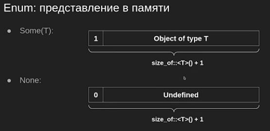

# Rust

## Лекция 2. Lifetimes, ownership & borrow checker

Vec — лежит на куче, указывает на начало, содержит информвция о размере и вместимости, парадигма RAII.

**Получение ресурса есть инициализация** ([англ.](https://ru.wikipedia.org/wiki/%D0%90%D0%BD%D0%B3%D0%BB%D0%B8%D0%B9%D1%81%D0%BA%D0%B8%D0%B9_%D1%8F%D0%B7%D1%8B%D0%BA) *Resource Acquisition Is Initialization (RAII)*) — [программная идиома](https://ru.wikipedia.org/wiki/%D0%98%D0%B4%D0%B8%D0%BE%D0%BC%D0%B0_(%D0%BF%D1%80%D0%BE%D0%B3%D1%80%D0%B0%D0%BC%D0%BC%D0%B8%D1%80%D0%BE%D0%B2%D0%B0%D0%BD%D0%B8%D0%B5)),
 смысл которой заключается в том, что с помощью тех или иных программных
 механизмов получение некоторого ресурса неразрывно совмещается с 
инициализацией, а освобождение — с уничтожением объекта.

Что происходит когда передаем вектор в функцию (по значению, а не по ссылке)? У нас же несколько скоупов, когда вызывать деструктор?

```rust
fn sum(v: Vec<i32>) -> i32 {
	v.iter().sum()
}

fn main() {
	let v = vec![1, 2, 3];
	println!("{}", sum(v));
}
```

В C++ на `sum(v)` был бы вызван copy-конструктор и the end (два теструктра, в main и в функции), в Rust иначе. Но в Rust мы муваем наш вектор в значение (в другую память).

- В Rust move - это memcpy (копируем со стека, в случае вектора — это три числа, указатель, длина и капасити)
- В C++ в коцне скоупа позовется destructor даже у moved value, в Rust - нет
- В Раст использование moved value - ошибка компиляции

<aside>
💡 Любое присваивание - это move

</aside>

```rust
let v = vec![1, 2, 3];
let v2 = v;
let v3 = v2;
println!("{:?}", v); // invalid
println!("{:?}", v2); // invalid
println!("{:?}", v3); // OK
```

- Clone - trait (интерфейс, обсудим далее), который реализует все типы, поддерживающие создание своей полной копии
- .clone() может быть произвольно дорогим (аллокации, рекурсивные вызовы, поэтому сложно)

Примеры Clone-типов

- Все элементарные типы: f32, f64, bool, i8, u8, ...
- Vec, String, HashMap (`не работает, код содержимое не является Clone`)
- Кортежи Clone-типов: (String, isize)
- Массивы Clone-типов: [Vec<String>; 16]
- Почти: File, TcpStream (try_clone) (`файловые дескрипторы не бесконечные, dup2 может проволиться`)
- Любой ваш тип, все атрибуты которого являются Clone:

```rust
#[derive(Clone)]
struct Foo {
	lines: Vec<String>,
	count: usize,
}
```

try_clone для памяти (вектор, хеш-мапы) есть в стандартной библиотеке. Но по факту обработать ошибку Out-of-memory оказывается сложно (*user space*), поэтому по дизайну мы лучше зафейлимся (panic - можно обработать, но не подразумевается).

trait Copy может быть реализован, если у негоо нет деструктора, то есть этот тип тривиальный и можно тривиально копировать (memcpy)

```rust
let x = 42;
let y = x;
println!("{}", x); // OK
println!("{}", y); // OK
```

- Все элементарные типы: f32, f64, bool, i8, u8, ...
- Кортежи Copy-типов: (i16, usize)
- Массивы Copy-типов: [u8; 1024]  (нужно быть осторожным на стеке)
- Любой ваш тип, атрибуты которого Copy:

```rust
#[derive(Clone, Copy)]
struct Bar {
	timestamp: u64,
}
```

Copy = memcpy (побитовое копирование), а Clone - может вызывать произвольно сложный код. Если метод и Clone и Copy, то Clone должен быть memcpy

```rust
// это в целом можно назвать деструктором
fn noname(_: Foo) {}

fn drop<T>(_: T) {}
```

```rust
struct Foo {
	first: ..
	second: ..
}

// если first - copy, то все ок, скомпилируется
// в ином случае мы сделали частичный move, 
// поэтому ошибка компиляции
drop(foo.first)
drop(foo)

// если такой код засунуть в if else, все заработает
// компилятор для себя пометит как нужно вызвать дескруктор
// для такого странного объекта

// но если есть свой деструктор (не тривиальный, написали за
// компилятор, то даже if-else нельзя, нужен сохраненый объект
```

Плюсы move-семантики Rust: 

- Явное копирование объектов через .clone()
- Use after move — ошибка компиляции
- Move присутствует у всех типов
- Move очень быстр (memcpy)

Но нельзя реализовать структуры со ссылками на свои поля

```rust
fn sum(v: &Vec<i32>) -> i32 {
	v.iter().sum()
}

fn main() {
	let v = vec![1, 2, 3];
	println!("sum: {}", sum(&v));
}
```

- Ссылка инвалидируется, когда объект, на который она ссылается,
переезжает (move, деструктор), даже если мы ссылаемся только на часть объекта
- Компилятор гарантирует, что инвалидированные ссылки не будут
использованы дальше в коде

Как устанавливается связь между ссылкой и объектом?

**Тривиальные случаи:**

- `let x = &object`
- `let x = &object.x`
- `let x = &v[0]`

*Нетривиальные случаи* — возврат методов и функций. Часто из функций мы возвращаем какие-то ссылки, хотелось бы не заставлять компилятор разгадывать потайной смысл, а указать четкие контракты.

```rust
struct Point {
	x: i32,
	y: i32,
}

impl Point {
	// lifetime связан с жизнью объекта, компилятор это сам понял
	fn get_x(&self) -> &i32 {
		&self.x
	}
}
```

<aside>
💡 Методы это те же самые функции, но с другим синтаксисом

</aside>

Короче говоря, когда у нас одна ссылка в методе и возвращаем ссылку, то всё просто. Что если у нас несколько аргументом? Или аргументов нет?

На второй вопрос проще ответить. У нас есть статические объекты, чей лайфтайм — время работы программы, у них есть специальный синтаксис.

```rust
const ZERO: Point = Point { x: 0, y: 0 };

fn get_zero() -> &'static Point {
	&ZERO
}
```

```rust
// Есть три варианта, что может вернуться: первый, второй 
// или же взависимости от чего-то. Компилятор будет пессимизировать решение
// выбираея наименьший лайфтайм.
fn foo(first: &Point, second: &Point) -> &Point {
	// ...
}
```

```rust
pub fn get_farthest<'a>(first: &'a Point, second: &'a Point) -> &'a Point {
	// а тут if, где возвращается одна из ссылок
	
	// получаем ссылку с лайф таймом 
	// равным меньшему времени жизни передаваемых в неё ссылок
}
```

```rust
fn get<'a>(data: &'a Vec<usize>, index: &usize) -> &'a usize {}
// тоже самое, что
fn get<'a, 'b>(data: &'a Vec<usize>, index: &'b usize) -> &'a usize {}
// лучше первый, чтобы не зашумлять лайфтаймами
```

Lifetime elision — правила не указывания лайфтаймов..

1. Все не указанные явно лайфтаймы входных параметров считаются разными:

```rust
fn do(foo: &Foo, bar: &Bar) { }
fn do<'a, 'b>(foo: &'a Foo, bar: &'b Bar) { }
```

1. Если во входных параметрах всего один лайфтайм, то он используется для всех выходных параметров: 

```rust
fn get_crd(name: u8, p: &Point) -> &i32
```

1. В методах у вовзращаемого значения по уполчанию лайфтайм `&self`
- Компилятор отслеживает связь между каждой ссылкой и объектом, на который она ссылается
- Компилятор гарантирует, что в момент использования любая ссылка валидна
- Сигнатуры функций иногда нужно проаннотировать лайфтаймами
- Если точный лайфтайм в момент компиляции не известен, он пессимизируется

```rust
fn set_x(x: &mut i32, value: i32) { } // изменяемая ссылка
```

```rust
let mut v = vec![1, 2, 3];
let r = &v[0];
v.clear(); // тут используется мутабельная ссылка
// но ссылку r мы уже испортили

v.push(4); // тоже не скомпилируется, т.к. есть ещё активная ссылка
```

**Эксклюзивность**:

- Создание &mut-ссылки инвалидирует все другие ссылки (const, mut) [*мутабельная ссылка не может существовать со всеми другими*]
- Таким образом, мы получаем memory safety

**Интуитивное обоснование**:

- Когда вы меняете структуру, указывающие на внутренности этой структуры ссылки могут оказаться невалидными
- Компилятор пессимизирует анализ, считая, что ровно это и прозойдет

**Disjoint references:**

```rust
User {
	login: String,
	password: String,
}

let a = &mut user.login
let b = &mut user.password
// это ОК, так как мы ссылаемся на две разных области
// памяти с одинаковым лайфтаймом
```

**Алиасинг**:

- Ссылки задают правила алиасинга языка
- Компилятор эксплуатирует эти правила для оптимизаций:
    - Если на объект все ссылки константные можно класть его на регистры
    - Если на объект есть только одна ссылка, можно класть его на регистры
- Нарушение правил алиасинга выяаляются в момент компиляции

**Reborrowing**:

```rust
fn foo(user: &mut User) {
	bar(user); // тут как бы должен быть mov
						// но этот код всё равно работает
	user.login = "petya".to_string();
}

fn bar(user: &mut User) {}
```

- Имея на руках &mut T, можно породить их неё другую &mut T или &T, временно инвалидируя исходную
- Из мутабельной ссылки можно генерировать константные:

```rust
let r1 = &*mut_user_link;
// они будут валидны, пока мы не заиспользуем мутабельную
// аналогичные правила с мутабельной
// то есть в примере выше происходит неявный реборруинг
// imp;icit reborrowing
bar(&mut *user);
```

*Disjoint mutable borrows*

- В любой момент времени, на объект может быть либо N константных ссылок, либо 1 неконстантная
- Это правило служит двум целям:
    - Обеспечение memory safety
    - Оптимизация аллокации регистров (алиасинг)
- Reborrowing позволяет порождать новые ссылки из &mut T, временно инвалидируя старую

## Лекция 3. **Slices, Enums & pattern matching, Traits**

**Slice** - ссылка на непрерывный участок памяти, содержащий неизвестное в compile-time количество элементов типа T. Смотрят на какую-то память: сегмент, куча, стек. Константная ссылка.

Тип слайса: &[T]. Слайс не то же самое, что ссылка на массив: &[T; 5]

Слайсы можно взять из: массива, вектора, другого слайса

- &array[1..3]
- &vec[..]
- &slice_one[..5]

Mutable slice — &mut v[..2]

Например, мы хотим взять два мьютебл салйса на непересекающиеся куски данных, если сделать это через &mut v[..x], &mut v[x..], то программа не скопилируется. Компилятору трудно рассуждать в таком случае, поэтому есть метод   `let (s1,s2) = array.split_at_mut(4)`. s1[0] = 1; s2[0] = 4;

Строковый слайс — &str, слайс байт, который гарантированно является валидной последовательностью utf-8

```rust
let string = String::from("Привет!");
let slice = &string[..4];
// но лучше так не делать, т.к. индексация по байтовая
// а utf-8 под каждый символ имеет свое количество байт,
// то мы можем застрять на середине какого-то символа
// при невалидном результате - panic!
```

```rust
let bytes = b"...";
let str_ = std::str::from_utf8(bytes).unwrap();
// одну ссылку переобразовали в другую
```

- Слайс - ссылка на непрерывный участок памяти, содержащий объекты одинакового типа
- Являются "толстым указателем" (имеют размер 2 указателей)
- С т.з. borrow checker, ничем не отличаются от обычных ссылок
- Строковые слайсы - как слайсы байт, но гарантированно валидный utf-8

Enum — это union, у которого есть tag

```rust
enum Option<T> {
	None,
	Some(T),
}

enum Result<T, E> {
	Ok(T),
	Err(E),
}

```

```rust

enum Transport {
	Car(String),
	Bus,
	Subway,
}

fn main() {
	let car = Transport::Car(text_here);
	let subway = Transport::Subway;
}
```



В общем случае это больше, чем size_of::<T>() + 1, т.к. выравнивание и что-то ещё..

Чему равен `size_of::<Option<bool>>()`? Один байт. Для None bool может выделить значение, которое он не использует…

Чему равен `size_of::<Option<&T>>()`? Ответ размер указателя (8 байт). Ссылки не могут быть нулевыми по спецификации

Также этот флаг может поставиться за счет паддинга, а может … 

```rust
struct Foo {
	x: i32,
	r: &'static str, // толстый указатель, 16 байт (указатель, длина)
} // 4 + 16 + 4(для выравнивания padding) = 24
// enum для Optional<Foo> будет зашит в ссылку (т.к. не может пустой)
```

```rust
// Tuple-like, struct-like
enum Shape {
	Point(i32, i32),
	Rectangle {
		x: i32,
		y: i32,
		width: i32,
		height: i32,
	},
}
```

- Являются tagged union: хранят дискриминант + значение одного из типов
- Поддержка в языке позволяет компилятору в некоторых случаях
оптимизировать размер типа

```rust
// ура хаскель!!!

let v = vec![1, 2, 3];
match v.first() { // .first() возвращает ссылку
	Some(x) => { // тут константная ссылка
		...
		// блок кода
	}
	None => ... // inline вызов
}
```

```rust
struct Book {
	// ...
	author: Option<String>,
}

fn foo(book: &Book) {
	// Match and move
	match book.author {
		Some(ref author) => println!(), // у нас тип не Copy, нам нельзя move
		// т.к. у нас константная ссылка
		None => println!(),	
	};

	match &book.author { // можно и так
		Some(author) => println!(),
		None => println!(),	
	};

	// ...

	match byte {
		0..=127 => true,
		128...=255 => false,
	};

	match book.country.as_str() { // строковый слайс, country: String
		"russia" | "ru" => true,
		_ => false,
	};
	
	// match guards
	match book.country.as_deref() { // country: Option<String>
		// две последовательные аллокации, если мы не сматчились
		Some(s) if s.to_lowercase() == "ru" => true,
		Some(s) if s.to_lowercase() == "russia" => true,
		
		// или же
		// тут одна аллокация
		Some(s) => matches!(s.to_lowercase().as_str(), "ru" | "russia"),
		_ => false,
	};
	
	// match на структурах
	// компилятор подскажет, если мы забуем какой-то кейс
	match p {
		Point { x: 0, .. } | Point { y: 0, .. } => None,
		Point { x: 1.., y: 1.. } => Some(0),
		Point { x: i32::MIN..=-1, y: 1.. } => Some(1),
		Point { x: i32::MIN..=-1, y: i32::MIN..=-1 } => Some(2),
		Point { x: 1.., y: i32::MIN..=-1 } => Some(3),
	}

	// Слайс
	match binary {
		[0x7f, b'E', b'L', b'F', ..] => true,
		_ => false,
	}
}
```

```rust
// Refutability - отвергаемость
// Irrefutable pattern - паттерн, который всегда подходит

x => { }
Point { x, y } => { }
Point { x, .. } => { } // можно не все поля писать
											// пропускаем несколько
(x, _) => { }        // не используем эту переменную

fn get_radius_squared(point: (i32, i32)) -> i32 {
	let (x, y) = point;
	x * x + y * y
}

fn do_stuff(context: &Context) {
	// получаем константные ссылки
	// имя соответствует полностью
	let Context { config, logger, .. } = context;
	// ...
}
```

```rust
let points = vec![
	(0, 0),
	(3, 5),
];

for &(x, y) in points.iter() {
	// ...
}
```

```rust
let mut vec = vec![1, 2, 3];
if let Some(x) = vec.pop() {
	// ...
}

// if let, while let это отдельные конструкции языка
let mut queue: VecDeque<_> = vec![source].into();
while let Some(vert) = queue.pop_front() {
	// ...
}
```

```rust
let Some(Message::StartGame(start_game)) = read_message(&mut reader) else {
	panic!("expected the first message to be 'start_game'");
};

// Else должен содержать код, который не возвращает управление:
// return
// break
// panic
// Любая функция с возвращаемым типом “!”
```

- Конструкция match позволяет перебрать по порядку шаблоны, которым значение может удовлетворять
- Ветви конструкции match должны покрывать все возможные случаи
- Irrefutable patterns можно использовать в let, for и сигнатурах
- Refutable patterns можно использовать в if let, while и let/else

```rust
// Почти как интерфейс

trait Rule {
	fn process(&self, packet: &IpPacket) -> Option<Outcome>;
}

impl Rule for ForwardingRule {
	fn process(&self, packet: &IpPacket) -> Option<Outcome> { /* ... */}
}

impl Rule for BlockingRule {
	fn process(&self, packet: &IpPacket) -> Option<Outcome> { /* ... */}
}

let fwd_rule = ForwardingRule { /* ... */ };
let rule: &dyn Rule = &fwd_rule; // каст ссылки
// dispatch — механизм в языках программирования, 
// позволяющий выбрать одну из нескольких функций в зависимости
//  от динамических типов или значений аргументов 
// (например, перегрузка методов в некоторых 
// языках программирования).
rule.process(&ip_packet);
```

Почему &dyn Trait, а не &Trait?
●
●
&dyn Trait - это толстый указатель (fat pointer)
&dyn Trait содержит два указателя: на объект и на его vtable

Box — владеющий указатель объекта на куче, тип которого заранее неизвестен. Обычные ссылки не уничтожают объект при выходе из скоупа, а Box делает это.

Таблица виртуальный функций лежит в сегменте программы.

```rust
// dyn стоит специально, чтобы показать, что тут толстый указатель
let rule: Box<dyn Rule> = Box::new(ForwardingRule { /* ... */ });
```

## Лекция 4. **Generics & static dispatch. Умные указатели**

Мы можем реализовать трейт Trait для типа T, если:

- Тип T определен в нашем крейте (*пока считаем, что это наш проект*)
- Или трейт Trait определен в нашем кейте

fully qualified

## Лекция N. Макросы

Препроцессор в Си и ++ ничего не знает про язык, то есть своими методами преобразует. В Rust макросы являются отображением последовательности токенов в код. А зачем это?

- Domain-specific синтаксис, например, json
- Изменение потока управления (иногда стоит подумать, не нужна ли нам всё-таки функция)
- Compile-time вычисления
- Реализация трейтов по-умолчанию (derive …)
- Рефлексия

Существуют декларативные макросы (!vec[]) и процедурные (derive к примеру).

<[_]> — компилятор, догадайся какой тут тип, так он ещё и массив, а как поймешь подставь его в <>

Пробел (к тому же \n, \t) — не токен, поэтому можно форматировать свободно макросы.

Прецедентность?
